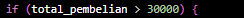
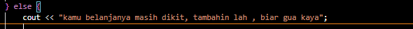

## 1. Nama, NIM, Kelas
- **Nama**: Abisar Fathir
- **NIM**: 103112400068
- **Kelas**: IF-12-05

## 2. Motivasi Belajar Struktur Data
Agar Saya bisa mengaplikasikan materi-materi struktur data ke game yang akan saya buat nanti

## 3. Dasar Teori
Contoh: Struktur data adalah cara untuk menyimpan dan mengorganisir data dalam komputer agar dapat digunakan secara efisien. Berikut adalah teori dasar mengenai **Graf** dan **Pohon**:

- **Graf**: Merupakan struktur data yang digunakan untuk menggambarkan hubungan antar objek yang disebut simpul (vertex) dan hubungan antar simpul yang disebut busur (edge).
- **Pohon**: Struktur data hierarkis yang terdiri dari simpul dan tepi, dengan satu simpul sebagai akar.

## 4. Guided
### 4.1 Guided 1
[latihan soal yang pertama ini adalah Diskon dari total pembelian di sebuah toko. Jika total pembelian kita melebihi syarat seperti di contoh latihan soal (pembelian >Rp.30000)  mereka akan diberikan diskon sesuai dengan persentase diskon yang diberikan, jika dibaca secara sistematis atau coding maka logika yang di guanakan adalah struktur kontrol if-else, yang berfungsi sebagai seleksi kondisional untuk menentukan alur program]  

## Lampiran Foto Laporan

       [Codingan ini mengecek apakah variabel **total_pembelian** kondisinya bernilai true atau tidak]   
    
[jika kondisi diatas true, maka program akan menjalankan kondisi dari kode blok yang tertera diatas]  
    
[jika kondisi nya adalah false, maka program akan menjalankan kondiri dari kode blok yang tertera di atas]  

[Berikut adalah output:]

### 4.2 Guided 2
[latihan soal yang kedua ini menunjukkan bagaimana cara kerja operator tambah satu duluan (pre-increment, ++r).]

Logika:

Nilai awal r adalah 20.

Saat menghitung s = 20 + ++r;, program akan menambah r menjadi 21 terlebih dahulu.

Kemudian s dihitung: s=20+21.

Hasilnya, r menjadi 21 dan s menjadi 41. Ini membuktikan bahwa r berubah sebelum perhitungan selesai.

[Berikut adalah output:]

[Codingan ini mengecek variabel r akan ditambahkan 1 terlebih dahulu lalu s akan menerima nilai dari 20 yang ditambahkan r]

[Jika di jalankan akan menghasilkan r bernilai 21 dan s bernilai 41]

### 4.3 Guided 3
[latihan soal yang ketiga ini adalah konversi suhu dari Celcius ke Fahrenheit. Tujuannya adalah memastikan hasil perhitungan tidak salah karena pembagian bilangan bulat.]

Logika:

Rumus konversi Farenheit adalah  
5
9
​
 ×C+32.

Jika kita menulis 9/5, C++ akan menganggapnya sebagai pembagian bilangan bulat, dan hasilnya salah (1, bukan 1.8).

Oleh karena itu, di kode kita menulis 9.0/5.0. Angka desimal (.0) ini memaksa C++ menghitung 1.8 dan memberikan hasil konversi suhu yang benar.

Ini menunjukkan bahwa kita harus menggunakan tipe data desimal (float atau double) jika perhitungan akan menghasilkan pecahan.

[Berikut adalah output:]

[Codingan ini menerima input dari user dan menyimpannya ke variabel celcius lalu di hitung menggunakan rumus fahrenheit = (9.0/5.0) * celcius + 32] 

[Jika di jalankan akan menghasilkan output konversi suhu dari celcius ke fahrenheit] 

## 5. Unguided
### 5.1 Unguided 1
[ Codingan berisi jadi 3 bagian 

Bagian 1:
#include <iostream>
using namespace std;

iostream isinya fungsi buat input-output standar (kayak cin buat input, cout buat output ke layar)

Bagian 2:
int main() {
    float a,b;
    cout << "Masukkan bilangan pertama: ";
    cin >> a;
    cout << "Masukkan bilangan kedua: ";
    cin >> b;

Disini code mendeklarasi 2 variabel bertipe float(a dan b) dan *cout* akan mengirimkan teks dan jawaban yang di input akan masuk lewat *cin*

Bagian 3:
    cout << "Hasil penjumlahan: " << a + b << endl;
    cout << "Hasil pengurangan: " << a - b << endl;
    cout << "Hasil perkalian: " << a * b << endl;

    if (b != 0) 
        cout << "Hasil pembagian: " << a / b << endl;
     else 
        cout << "Pembagian dengan nol tidak diperbolehkan." << endl;

    return 0;
    Codingan diatas adalah codingan dari operasi dasar matematika((tambah, kurang, kali, bagi).). khusus untuk bagi jika b adalah 0 maka program tidak akan berlanjut
}]

### 5.2 Unguided 2
[Codingan Unguided terbagi menjadi 3 bagian 

bagian pertama 1

#include <iostream>
#include <string>
using namespace std;

string angkaKeTulisan(int n) {
    string angka[] = {"nol", "satu", "dua", "tiga", "empat", "lima",
                      "enam", "tujuh", "delapan", "sembilan", "sepuluh", "sebelas"};

    if (n < 12) {
        return angka[n];
    } else if (n < 20) {
        return angka[n - 10] + " belas";
    } else if (n < 100) {
        int puluh = n / 10;
        int satuan = n % 10;
        string teks = angka[puluh] + " puluh";
        if (satuan > 0) teks += " " + angka[satuan];
        return teks;
    } else if (n == 100) {
        return "seratus";
    }
    return "di luar jangkauan";
    Bagian ini berisi fungsi angkaKeTulisan(int n).
    Fungsinya adalah mengubah angka ke bentuk tulisan bahasa Indonesia.
    Jika n < 12, langsung ambil kata dari array.
    Jika 12 ≤ n < 20, bentuknya angka[n-10] + " belas".
    Jika 20 ≤ n < 100, angka dipecah menjadi puluhan dan satuan.
    Jika n == 100, hasilnya "seratus".
    Jika di luar itu, ditampilkan "di luar jangkauan"
    
}
bagian 2

int main() {
    int x;
    cout << "Masukkan angka (0-100): ";
    cin >> x;

    Bagian ini adalah awal dari program utama.
    Program menyiapkan variabel x untuk menyimpan angka input dari user.
    cout menampilkan teks perintah ke layar, lalu cin membaca angka yang dimasukkan user dan menyimpannya ke x.

bagian 3
    cout << x << " : " << angkaKeTulisan(x) << endl;
    return 0;
    Bagian ini fungsinya menampilkan angka yang dimasukkan user beserta hasil konversinya.
}]

### 5.3 Unguided 3

bagian 1
[#include <iostream>
using namespace std;

int main() {
    int n;
    cout << "Input: ";
    cin >> n;

    Program menggunakan library <iostream> untuk input-output.
Variabel n dideklarasikan untuk menyimpan input user.
cout menampilkan pesan "input" , lalu cin membaca angka yang dimasukkan user dan menyimpannya ke n.

bagian 2

    for (int i = n; i >= 1; i--) {
        for (int j = i; j >= 1; j--) {
            cout << j << " ";
        }
        cout << "* ";
        for (int j = 1; j <= i; j++) {
            cout << j << " ";
        }
        cout << endl;
        for (int i = n; i >= 1; i--) adalah perulangan untuk mengatur jumlah baris, dari n turun ke 1.

Di dalamnya ada 3 bagian:
Kiri angka menurun dari i ke 1.
Tengah simbol * sebagai pemisah.
Kanan angka menaik dari 1 ke i.
endl digunakan untuk pindah baris setelah mencetak satu baris pola.

bagian 3

    }
    return 0;
}.
return 0; menandakan program berakhir dengan normal.

output:

 
]

## 6. Kesimpulan
[Isi dengan kesimpulan dari seluruh praktikum ini, apakah tujuan praktikum tercapai, dan bagaimana Anda mengimplementasikan dan memahami teori yang dipelajari.]

## 7. Referensi
1. [Buku atau artikel yang Anda gunakan untuk referensi, jika ada]
2. [Sumber lain yang relevan dengan topik praktikum ini]