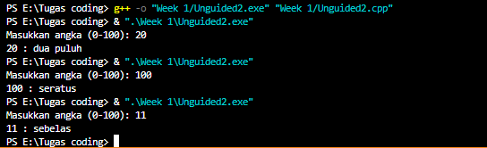
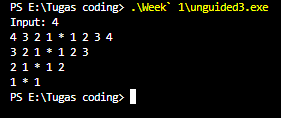

## 1. Nama, NIM, Kelas
- **Nama**: Abisar Fathir
- **NIM**: 103112400068
- **Kelas**: IF-12-05

## 2. Motivasi Belajar Struktur Data
Agar Saya bisa mengaplikasikan materi-materi struktur data ke game yang akan saya buat nanti

## 3. Dasar Teori
Hubungan C++ dengan Struktur Data
Karena C++ mendukung konsep OOP dan manajemen memori secara langsung, bahasa ini sangat cocok untuk implementasi struktur data seperti linked list, stack, queue, pohon (tree), graf, dan sebagainya. Buku ini memberi contoh bagaimana struktur data tersebut diimplementasikan dalam C++ menggunakan kelas, pointer, dan referensi.

**Keunggulan C++ dalam Pengelolaan Data**
Kemampuan mengakses memori secara langsung lewat pointer dan referensi memungkinkan manipulasi struktur data yang efisien.

Dukungan OOP memudahkan pembungkusan data dan fungsi bersama dalam satu entitas (kelas), sehingga struktur data dapat dibuat lebih modular dan mudah dipelihara.

C++ memungkinkan penggunaan overloading, templating, dan fitur STL (Standard Template Library), yang mempercepat pengembangan struktur data umum seperti vektor, daftar, stack, dan sebagainya.

## 4. Guided
### 4.1 Guided 1
[latihan soal yang pertama ini adalah Diskon dari total pembelian di sebuah toko. Jika total pembelian kita melebihi syarat seperti di contoh latihan soal (pembelian >Rp.30000)  mereka akan diberikan diskon sesuai dengan persentase diskon yang diberikan, jika dibaca secara sistematis atau coding maka logika yang di guanakan adalah struktur kontrol if-else, yang berfungsi sebagai seleksi kondisional untuk menentukan alur program]  

## Lampiran Foto Laporan
[Codingan ini mengecek apakah variabel **total_pembelian** kondisinya bernilai true atau tidak] 
[jika kondisi diatas true, maka program akan menjalankan kondisi dari kode blok yang tertera diatas] 
[jika kondisi nya adalah false, maka program akan menjalankan kondiri dari kode blok yang tertera di atas] 

[Berikut adalah output: ]

### 4.2 Guided 2
[latihan soal yang kedua ini menunjukkan bagaimana cara kerja operator tambah satu duluan (pre-increment, ++r).]
*Logika Program* (dengan gaya seperti yang kamu mau)
Program mengecek ekspresi ++r pada saat dijalankan.
Jika operator ++ digunakan di depan variabel (++r), maka nilai r langsung ditambah 1 sebelum dipakai dalam operasi.
Dengan demikian:
r yang awalnya 20, menjadi 21.
s mendapatkan hasil penjumlahan 20 dengan nilai r yang baru (21), sehingga s = 41.
Setelah itu program menampilkan hasil:

"nilai r adalah : 21"

"nilai s adalah : 41"

[Berikut adalah output:]

[Codingan ini mengecek variabel r akan ditambahkan 1 terlebih dahulu lalu s akan menerima nilai dari 20 yang ditambahkan r]

[Jika di jalankan akan menghasilkan r bernilai 21 dan s bernilai 41]

### 4.3 Guided 3
[latihan soal yang ketiga ini adalah konversi suhu dari Celcius ke Fahrenheit. Tujuannya adalah memastikan hasil perhitungan tidak salah karena pembagian bilangan bulat.]

Logika:
Rumus konversi Farenheit adalah  
5
9
 ×C+32.
Jika kita menulis 9/5, C++ akan menganggapnya sebagai pembagian bilangan bulat, dan hasilnya salah (1, bukan 1.8).
Oleh karena itu, di kode kita menulis 9.0/5.0. Angka desimal (.0) ini memaksa C++ menghitung 1.8 dan memberikan hasil konversi suhu yang benar.
Ini menunjukkan bahwa kita harus menggunakan tipe data desimal (float atau double) jika perhitungan akan menghasilkan pecahan.

[Berikut adalah output:]

[Codingan ini menerima input dari user dan menyimpannya ke variabel celcius lalu di hitung menggunakan rumus fahrenheit = (9.0/5.0) * celcius + 32] 

[Jika di jalankan akan menghasilkan output konversi suhu dari celcius ke fahrenheit] 

## 5. Unguided
### 5.1 Unguided 1
[ Codingan berisi jadi 3 bagian 

Bagian 1:
#include <iostream>
using namespace std;

iostream isinya fungsi buat input-output standar (kayak cin buat input, cout buat output ke layar)

Bagian 2:
int main() {
    float a,b;
    cout << "Masukkan bilangan pertama: ";
    cin >> a;
    cout << "Masukkan bilangan kedua: ";
    cin >> b;

Disini code mendeklarasi 2 variabel bertipe float(a dan b) dan *cout* akan mengirimkan teks dan jawaban yang di input akan masuk lewat *cin*

Bagian 3:
    cout << "Hasil penjumlahan: " << a + b << endl;
    cout << "Hasil pengurangan: " << a - b << endl;
    cout << "Hasil perkalian: " << a * b << endl;

    if (b != 0) 
        cout << "Hasil pembagian: " << a / b << endl;
     else 
        cout << "Pembagian dengan nol tidak diperbolehkan." << endl;

    return 0;
    Codingan diatas adalah codingan dari operasi dasar matematika((tambah, kurang, kali, bagi).). khusus untuk bagi jika b adalah 0 maka program tidak akan berlanjut
output:
[program output](image/Ug3.png)
}]

### 5.2 Unguided 2
[Codingan Unguided terbagi menjadi 3 bagian 

bagian pertama 1

#include <iostream>
#include <string>
using namespace std;

string angkaKeTulisan(int n) {
    string angka[] = {"nol", "satu", "dua", "tiga", "empat", "lima",
                      "enam", "tujuh", "delapan", "sembilan", "sepuluh", "sebelas"};

    if (n < 12) {
        return angka[n];
    } else if (n < 20) {
        return angka[n - 10] + " belas";
    } else if (n < 100) {
        int puluh = n / 10;
        int satuan = n % 10;
        string teks = angka[puluh] + " puluh";
        if (satuan > 0) teks += " " + angka[satuan];
        return teks;
    } else if (n == 100) {
        return "seratus";
    }
    return "di luar jangkauan";
    Bagian ini berisi fungsi angkaKeTulisan(int n).
    Fungsinya adalah mengubah angka ke bentuk tulisan bahasa Indonesia.
    Jika n < 12, langsung ambil kata dari array.
    Jika 12 ≤ n < 20, bentuknya angka[n-10] + " belas".
    Jika 20 ≤ n < 100, angka dipecah menjadi puluhan dan satuan.
    Jika n == 100, hasilnya "seratus".
    Jika di luar itu, ditampilkan "di luar jangkauan"
    
}
bagian 2

int main() {
    int x;
    cout << "Masukkan angka (0-100): ";
    cin >> x;

    Bagian ini adalah awal dari program utama.
    Program menyiapkan variabel x untuk menyimpan angka input dari user.
    cout menampilkan teks perintah ke layar, lalu cin membaca angka yang dimasukkan user dan menyimpannya ke x.

bagian 3
    cout << x << " : " << angkaKeTulisan(x) << endl;
    return 0;
    Bagian ini fungsinya menampilkan angka yang dimasukkan user beserta hasil konversinya.
output:

}]

### 5.3 Unguided 3

bagian 1
[#include <iostream>
using namespace std;

int main() {
    int n;
    cout << "Input: ";
    cin >> n;

    Program menggunakan library <iostream> untuk input-output.
Variabel n dideklarasikan untuk menyimpan input user.
cout menampilkan pesan "input" , lalu cin membaca angka yang dimasukkan user dan menyimpannya ke n.

bagian 2

    for (int i = n; i >= 1; i--) {
        for (int j = i; j >= 1; j--) {
            cout << j << " ";
        }
        cout << "* ";
        for (int j = 1; j <= i; j++) {
            cout << j << " ";
        }
        cout << endl;
        for (int i = n; i >= 1; i--) adalah perulangan untuk mengatur jumlah baris, dari n turun ke 1.

Di dalamnya ada 3 bagian:
Kiri angka menurun dari i ke 1.
Tengah simbol * sebagai pemisah.
Kanan angka menaik dari 1 ke i.
endl digunakan untuk pindah baris setelah mencetak satu baris pola.

bagian 3

    }
    return 0;
}.
return 0; menandakan program berakhir dengan normal.

output:

 
]

## 6. Kesimpulan
[memahami dasar-dasar pemrograman C++ telah tercapai. Melalui implementasi program, praktikan dapat mengenal struktur dasar C++, penggunaan input-output dengan cin dan cout, serta penerapan logika sederhana dalam pemrosesan data. Teori yang dipelajari, seperti konsep dasar C++ dan penerapan alur program, dapat dipahami dengan baik melalui latihan langsung dalam bentuk kode. Dengan demikian, praktikum ini membantu memperkuat pemahaman teori sekaligus keterampilan praktik dalam penggunaan bahasa pemrograman C++.]

## 7. Referensi
Ramadhana, Ilmi, and Bambang Sujatmiko. "Pengembangan Aplikasi Kamus Bahasa Pemrograman C++ Berbasis Android Untuk Meningkatkan Kompetensi Kognitif Mata Kuliah Struktur Data." IT-Edu: Jurnal Information Technology and Education 3.1 (2018). https://doi.org/10.26740/it-edu.v3i1.24755

Anita Sindar, R. M. S. Struktur Data Dan Algoritma Dengan C++. Vol. 1. CV. AA. RIZKY, 2019. https://books.google.com/books?hl=id&lr=&id=GP_ADwAAQBAJ&oi=fnd&pg=PA23&dq=c%2B%2B+struktur+data&ots=86j8RlZQeV&sig=l0bNTnoJd9vDNJT69nmFF3c_GZA