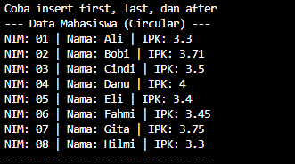

## 1. Nama, NIM, Kelas
- **Nama**: Abisar Fathir
- **NIM**: 103112400068
- **Kelas**: IF-12-05

## 2. Motivasi Belajar Struktur Data
Agar Saya bisa mengaplikasikan materi-materi struktur data ke game yang akan saya buat nanti

## 3. Dasar Teori
A. DASAR TEORI
Berikut adalah dasar teori singkat untuk laporan Anda:

DASAR TEORI

1. Multi Linked List
Multi List merupakan sekumpulan list berbeda yang memiliki keterhubungan satu sama lain. Struktur ini biasanya terdiri dari List Induk dan List Anak, di mana setiap elemen pada List Induk dapat menunjuk ke sebuah List Anak tersendiri. Karakteristik utamanya adalah ketergantungan data; jika sebuah elemen Induk dihapus, maka seluruh elemen Anak yang terhubung dengannya juga harus dihapus.

2. Circular Doubly Linked List
Struktur data ini adalah variasi dari linked list yang memiliki dua pointer, yaitu next dan prev, pada setiap elemennya. Sifat circular berarti list ini tidak memiliki nilai NULL di ujungnya; pointer next pada elemen terakhir mengarah kembali ke elemen pertama, dan pointer prev pada elemen pertama mengarah ke elemen terakhir. Hal ini memungkinkan penelusuran data dilakukan dua arah (maju-mundur) secara terus-menerus tanpa henti.

## 4. Guided
### 4.1 Guided 1 (multilist.h)
Pembuatan ADT Multi Linked List Dengan Operasi Insertlast() untuk induk dan anak,  findelm() untuk induk dan anak dan alokasi() untuk induk dan anak
#ifndef MULTILIST_H_INCLUDED
#define MULTILIST_H_INCLUDED
#define Nil NULL

typedef int infotype;
typedef struct elemen_induk *address_induk;
typedef struct elemen_anak *address_anak;

struct elemen_anak {
    infotype info;
    address_anak next, prev;
};

struct list_anak {
    address_anak first, last;
};

struct elemen_induk {
    infotype info;
    list_anak anak;
    address_induk next, prev;
};

struct list_induk {
    address_induk first, last;
};

void createList(list_induk &L);
address_induk alokasi(infotype x);
void insertLastInduk(list_induk &L, address_induk P);
address_induk findInduk(list_induk L, infotype x);
void insertLastAnak(list_anak &LA, address_anak PA);
address_anak alokasiAnak(infotype x);
void printInfo(list_induk L);

#endif

Penjelasan:
File ini adalah header file yang berisi deklarasi (definisi) dari semua struktur data dan fungsi-fungsi yang akan digunakan dalam program.
Fungsinya:

Mendefinisikan struktur data multi-level list: elemen_anak, list_anak, elemen_induk, dan list_induk
Mendefinisikan tipe data seperti infotype (int), address_induk (pointer ke elemen induk), dan address_anak (pointer ke elemen anak)
Mendeklarasikan fungsi-fungsi yang akan diimplementasikan di file .cpp: createList, alokasi, insertLastInduk, findInduk, alokasiAnak, insertLastAnak, dan printInfo
Pake header guard (#ifndef, #define, #endif) biar file ini gak diinclude berkali-kali yang bisa bikin error

### 4.2 Guided 2 (mutilist.cpp)
Topik: Implementasi fungsi dasar Multi Linkled list untuk bagian induk.
#include "multilist.h"
#include <iostream>
using namespace std;

void createList(list_induk &L) {
    L.first = Nil;
    L.last = Nil;
}

address_induk alokasi(infotype x) {
    address_induk P = new elemen_induk;
    P->info = x;
    P->next = Nil;
    P->prev = Nil;
    P->anak.first = Nil;
    P->anak.last = Nil;
    return P;
}

void insertLastInduk(list_induk &L, address_induk P) {
    if (L.first == Nil) {
        L.first = P;
        L.last = P;
    } else {
        L.last->next = P;
        P->prev = L.last;
        L.last = P;
    }
}

address_induk findInduk(list_induk L, infotype x) {
    address_induk P = L.first;
    while (P != Nil) {
        if (P->info == x) return P;
        P = P->next;
    }
    return Nil;
}

Penjelasan Singkat:
File multilist.cpp
File ini berisi implementasi dari fungsi-fungsi yang udah dideklarasiin di multilist.h. Jadi kalau di header cuma bilang "nanti ada fungsi createList, alokasi, insertLast, dll", nah di file ini baru dijelasin cara kerjanya gimana dengan logika pemrograman lengkap.
Fungsinya:

Mengimplementasikan semua operasi dasar untuk list induk, seperti bikin list kosong, bikin elemen baru, masukin elemen ke list, cari elemen, hapus elemen, cetak list, dan operasi-operasi lainnya.
Di dalam fungsi-fungsi ini ada logika pemrograman pake percabangan (if-else), perulangan (while), dan manipulasi pointer buat ngatur hubungan antar elemen.

### 4.3 Guided 3 (multilist_anak.cpp)
Implementasi fungsi dasar Multi Linked list untuk bagian anak
#include "multilist.h"
#include <iostream>
using namespace std;

address_anak alokasiAnak(infotype x) {
    address_anak P = new elemen_anak;
    P->info = x;
    P->next = Nil;
    P->prev = Nil;
    return P;
}

void insertLastAnak(list_anak &LA, address_anak PA) {
    if (LA.first == Nil) {
        LA.first = PA;
        LA.last = PA;
    } else {
        LA.last->next = PA;
        PA->prev = LA.last;
        LA.last = PA;
    }
}

void printInfo(list_induk L) {
    address_induk PI = L.first;
    while (PI != Nil) {
        cout << "Induk: " << PI->info << endl;
        address_anak PA = PI->anak.first;
        while (PA != Nil) {
            cout << "  Anak: " << PA->info << endl;
            PA = PA->next;
        }
        PI = PI->next;
    }
}

Penjelasan:
File ini berisi implementasi dari fungsi-fungsi khusus untuk operasi di level anak. Jadi kalau multilist.cpp ngurusin induknya, file ini ngurusin anak-anaknya.
Fungsinya:

Mengimplementasikan semua operasi untuk list anak, seperti bikin elemen anak baru, masukin anak ke list, hapus anak, cari anak, dan operasi-operasi lainnya yang berhubungan dengan anak.
Ada juga fungsi printInfo yang tugasnya cetak semua isi list (induk beserta anak-anaknya) dengan format yang rapi dan berindentasi.
Di dalam fungsi-fungsi ini juga ada logika pemrograman pake percabangan, perulangan, dan manipulasi pointer buat ngatur hubungan antar elemen anak.

### 4.4 guided 4(main.cpp)
Main.cpp disini digunakan untuk mengcompilasi codingan dari multilist_anak.cpp dan multilist.cpp
#include "multilist.h"
#include <iostream>
using namespace std;

int main() {
    list_induk L;
    createList(L);

    address_induk P1 = alokasi(1);
    insertLastInduk(L, P1);

    address_anak PA1 = alokasiAnak(10);
    insertLastAnak(P1->anak, PA1);

    address_induk P2 = alokasi(2);
    insertLastInduk(L, P2);

    address_anak PA2 = alokasiAnak(20);
    insertLastAnak(P2->anak, PA2);

    printInfo(L);
    return 0;
}

Output:
File ini adalah program utama yang memanggil dan menggunakan semua fungsi yang udah dibuat di multilist.h, multilist.cpp, dan multilist_anak.cpp.
Fungsinya:

Tempat menjalankan program dan menguji semua fungsi yang udah dibuat
Berisi alur program dari awal sampai akhir: bikin list, tambahin induk, tambahin anak ke induk, cetak hasilnya
Di sini kita pakai fungsi-fungsi seperti createList, alokasi, insertLastInduk, alokasiAnak, insertLastAnak, dan printInfo untuk membangun struktur multi-level list

## 5. Unguided
### 5.1 Unguided 1
Untuk Unguided 5.1 kita diminta untuk mengimplementasi semua fungsi pada multilist.h yang akan di panggil di main.cpp fungsi di multilist.h teridiri dari berikut
Code Multilist_anak
1 [Unguided](<Multi Linked List/multilist_anak.cpp>)
Code Main.cpp
2 [Unguided](<Multi Linked List/main.cpp>)
Code Multilist
3 [Unguided](<Multi Linked List/multilist.cpp>)
Code Header
4 [Unguided](<Multi Linked List/multilist.h>)

[Output](image-2.png)

Penjelasan:
File 1: multilist.h
File ini adalah header file yang berisi deklarasi (definisi) dari semua fungsi dan struktur data yang akan digunakan. Ibaratnya ini adalah "daftar isi" atau "blueprint" dari program.
Isinya:

Struktur data: Definisi elemen_anak, list_anak, elemen_induk, list_induk
Deklarasi fungsi: Semua fungsi seperti createList, insertFirst, insertLast, insertAfter, delFirst, delLast, delP, findElm, printInfo, dll.

File ini tidak ada logika pemrograman, cuma ngasih tau "nanti ada fungsi apa aja yang bisa dipake".

File 2: multilist.cpp
File ini berisi implementasi (program yang lebih detail) dari fungsi-fungsi yang sudah dideklarasikan di multilist.h. Di sini ada logika pemrograman seperti percabangan (if-else), perulangan (while), dan operasi pointer.
Fungsi-fungsi penting:

createList: Inisialisasi list kosong
alokasi: Membuat elemen induk baru di memory
insertFirst/insertLast/insertAfter: Memasukkan elemen induk ke posisi tertentu
delFirst/delLast/delAfter: Menghapus elemen induk dari posisi tertentu
delP: Menghapus induk berdasarkan nilai (harus hapus semua anaknya dulu!)
findElm: Mencari elemen induk berdasarkan nilai
printInfo: Mencetak semua induk beserta anak-anaknya
nbList: Menghitung jumlah elemen induk

File multilist_anak.cpp juga sama, tapi khusus untuk operasi level anak seperti insertFirstAnak, delPAnak, findElmAnak, dll.

File 3: main.cpp
File ini adalah program utama yang memanggil semua fungsi dari multilist.h. Program akan berjalan sesuai alur:
Alur program:

Buat list induk dengan createList
Tambah beberapa induk menggunakan insertFirst atau insertLast
Cari induk tertentu dengan findElm, lalu tambahkan anak ke induk tersebut menggunakan insertLastAnak
Cetak isi list dengan printInfo untuk melihat struktur induk dan anak
Hapus anak dengan delPAnak atau hapus induk dengan delP
Akhiri program dengan menghapus semua elemen (dealokasi memory)

Intinya main.cpp adalah tempat kita menggunakan semua fungsi yang sudah dibuat untuk membuat program yang berfungsi.

Jadi:

multilist.h = Daftar fungsi
multilist.cpp = Isi/logika fungsinya
main.cpp = Pakai fungsi-fungsi tersebut untuk jalankan program

### 5.2 Unguided 2
Code Circularist
1 [Unguided](circularist.cpp)
Code main
2 [Unguided](main.cpp)
Code header Circularist
3 [Unguided](circularlist.h)

Penjelasan:
1. circularlist.h (Header File)
 Fungsi: Sebagai cetak biru (ADT) program.
 Isi: Mendefinisikan tipe data struct Mahasiswa dan struct ElmList.
 Ciri Khas: Karena Doubly Linked List, elemen memiliki dua pointer: next (maju) dan prev (mundur). Berisi deklarasi fungsi agar bisa dipanggil di main.

2. circularlist.cpp (Implementasi)
 Fungsi: Berisi logika/kodingan dari setiap fungsi (Insert, Delete, Find).
 Konsep Circular: List tidak memiliki ujung NULL. Elemen Last selalu menunjuk kembali ke First.
 Logika insertFirst: Karena list memutar, saat memasukkan elemen di awal, kita harus mengupdate pointer next milik elemen Terakhir agar berpindah menunjuk ke elemen baru tersebut, menjaga lingkaran tidak putus.

3. main.cpp (Driver/Main)
 Fungsi: Program utama untuk menguji kode.
 Isi:
    Fungsi createData: Mempermudah input data mahasiswa.
    Fungsi main: Menjalankan skenario insertFirst, insertLast, dan insertAfter untuk membuktikan bahwa data tersambung secara circular dan urutannya benar.

Output:

## 6. Kesimpulan
B. KESIMPULAN
Berikut adalah kesimpulan singkatnya:

Multi Linked List (List Induk-Anak) Struktur ini digunakan untuk data yang memiliki hirarki (bertingkat). Satu elemen Induk bisa memiliki banyak Anak. Poin kuncinya adalah ketergantungan memori: jika Induk dihapus, maka seluruh Anak di dalamnya wajib dihapus terlebih dahulu agar tidak terjadi kebocoran memori.

Circular Doubly Linked List Struktur ini digunakan untuk data berurutan yang saling nyambung tanpa putus (membentuk lingkaran). Tidak ada nilai NULL di ujung list karena elemen Terakhir kembali menunjuk ke Awal. Tipe ini memungkinkan akses data dua arah (maju-mundur) secara terus-menerus.

## 7. Referensi
Ramadhana, Ilmi, and Bambang Sujatmiko. "Pengembangan Aplikasi Kamus Bahasa Pemrograman C++ Berbasis Android Untuk Meningkatkan Kompetensi Kognitif Mata Kuliah Struktur Data." IT-Edu: Jurnal Information Technology and Education 3.1 (2018). https://doi.org/10.26740/it-edu.v3i1.24755

Anita Sindar, R. M. S. Struktur Data Dan Algoritma Dengan C++. Vol. 1. CV. AA. RIZKY, 2019. https://books.google.com/books?hl=id&lr=&id=GP_ADwAAQBAJ&oi=fnd&pg=PA23&dq=c%2B%2B+struktur+data&ots=86j8RlZQeV&sig=l0bNTnoJd9vDNJT69nmFF3c_GZA