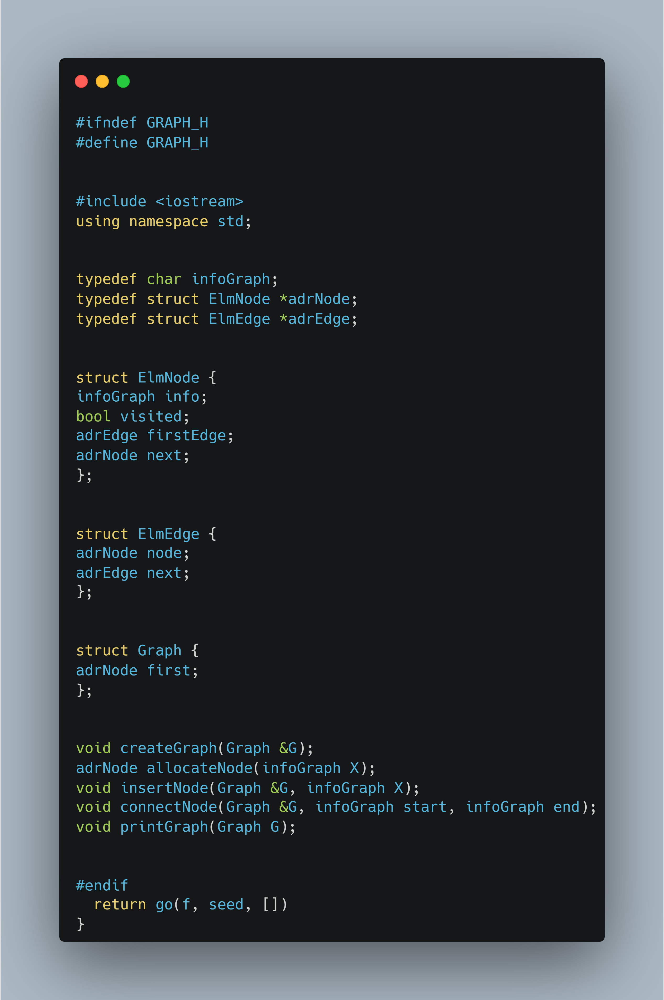
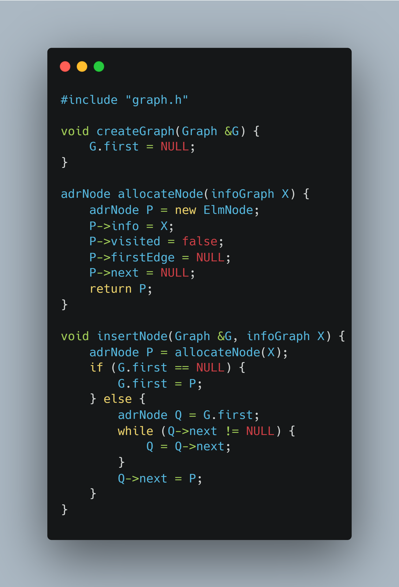
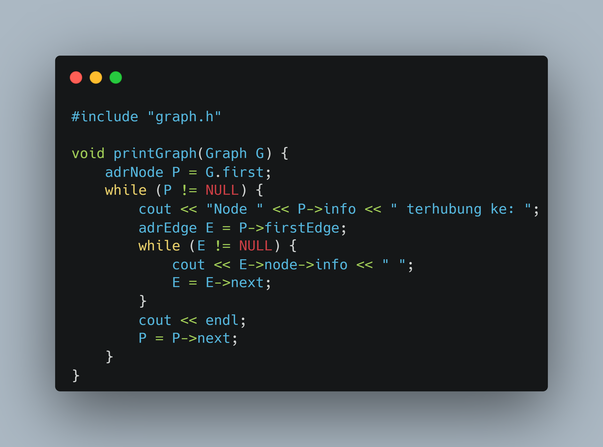
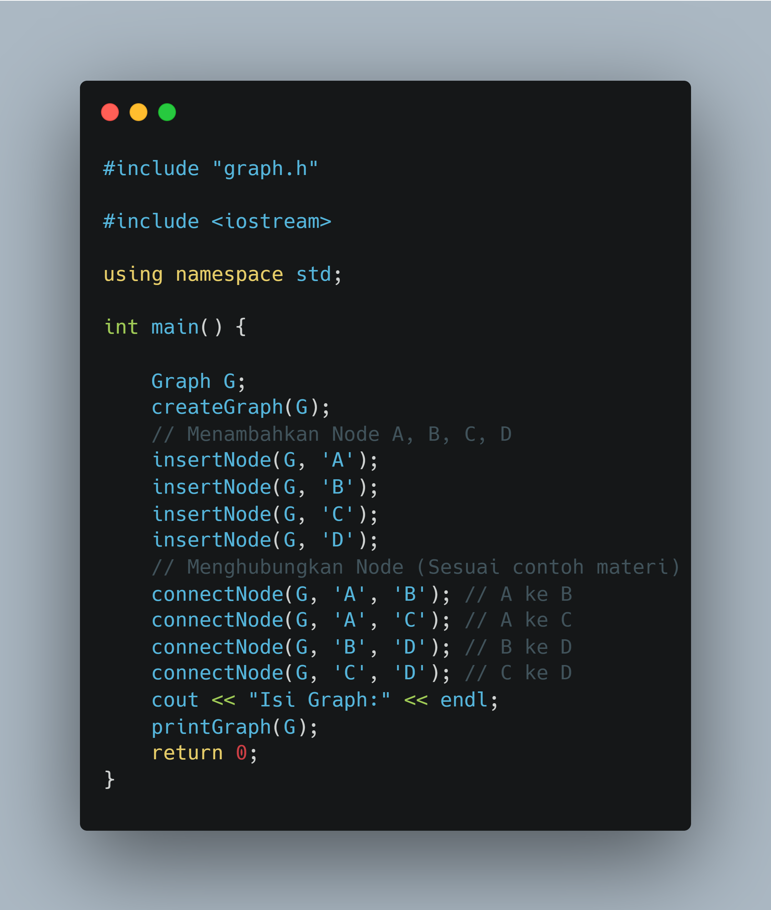
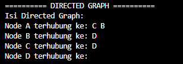
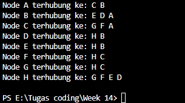
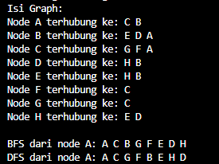

## 1. Nama, NIM, Kelas
- **Nama**: Abisar Fathir
- **NIM**: 103112400068
- **Kelas**: IF-12-05

## 2. Motivasi Belajar Struktur Data
Agar Saya bisa mengaplikasikan materi-materi struktur data ke game yang akan saya buat nanti

## 3. Dasar Teori
Graph adalah struktur data yang terdiri dari node (simpul) dan edge (sisi penghubung). Bayangkan peta kota: kota-kota adalah node, dan jalan yang menghubungkan antar kota adalah edge.2. Jenis Graph: 

2 Jenis Graph
A) Directed Graph (Graf Berarah)
Edge punya arah
Jika A terhubung ke B, belum tentu B terhubung ke A
Contoh: jalan satu arah, seperti tombol follow di social media

b) Undirected Graph (Graf Tidak Berarah)
Edge tidak punya arah
Jika A terhubung ke B, otomatis B juga terhubung ke A
Contoh: pertemanan Facebook, jalan dua arah

3. Representasi GraphKita pakai Multi Linked List (Adjacency List):
Setiap node punya daftar tetangganya (edge)
Lebih hemat memori dibanding array 2 dimensi
Lebih fleksibel untuk graph dinamis

## 4. Guided
### 4.1 Guided 1 (Graph.h)

### 4.2 Guided 2 (graph_edge.cpp)

### 4.3 Guided 3 (graph.cpp)

### 4.4 guided 4(graph_Print.cpp)

### 4.5 guided(main.cpp)

Penjelasan:
Fungsi ConnectNodeDirected berfungsi untuk menghubungkan dua node secara berarah.
Fungsi ini melakukan pengecekan kedua node apakah valid, lalu membuat satu edge baru dari N1 ke N2. Edge tersebut ditambahkan di awal linked list edge milik N1.
Hasilnya adalah hubungan satu arah dari N1 ke N2, dimana N1 bisa mencapai N2 tetapi N2 tidak bisa mencapai N1. Seperti jalan satu arah atau follow Instagram.

Output:
!

## 5. Unguided
### 5.1 Unguided 1

Code Graph Edge
[Graph Edge](grap_edge.cpp)

Code Graph Print
[Graph Print](graph_print.cpp)

Code Graph
[Graph](graph.cpp)

Code Main
[Main](main.cpp)

Penjelasan:
Fungsi ConnectNode berfungsi untuk menghubungkan dua node dalam graph secara undirected (tidak berarah).
ConnectNode disini melakukan pengecekan terlebih dahulu apakah kedua node valid (tidak NULL). Jika valid, maka fungsi akan membuat dua edge untuk merepresentasikan hubungan dua arah antara kedua node.
Pertama, fungsi membuat edge pertama (e1) yang menghubungkan node N1 ke node N2. Edge ini ditambahkan di awal linked list edge milik N1 dengan cara membuat pointer Node menunjuk ke N2, lalu pointer Next menunjuk ke firstEdge yang lama. Setelah itu, firstEdge dari N1 diupdate agar menunjuk ke edge baru (e1).
Kedua, fungsi membuat edge kedua (e2) yang menghubungkan node N2 ke node N1. Edge ini juga ditambahkan di awal linked list edge milik N2 dengan cara yang sama, yaitu pointer Node menunjuk ke N1, lalu pointer Next menunjuk ke firstEdge yang lama. Kemudian firstEdge dari N2 diupdate agar menunjuk ke edge baru (e2).
Dengan membuat dua edge sekaligus, graph menjadi undirected yang berarti jika node A terhubung ke node B, maka node B juga otomatis terhubung ke node A. Ini berbeda dengan directed graph yang hanya membuat satu edge sehingga hubungannya hanya satu arah.
Hasil dari ConnectNode adalah hubungan dua arah antara dua node, seperti jalan raya dua arah atau pertemanan di Facebook dimana jika A berteman dengan B, maka B juga otomatis berteman dengan A.

Output: 

### 5.2 Unguided 2

Code Graph Edge
[Graph Edge](grap_edge.cpp)

Code Graph Print
[Graph Print](graph_print.cpp)

Code Graph
[Graph](graph.cpp)

Code Main
[Main](main.cpp)

Code Traversal
[Graph DFS](graph_traversal.cpp)

Penjelasan:
Fungsi PrintDFS berfungsi untuk menelusuri graph secara mendalam menggunakan metode Depth-First Search.
DFS disini melakukan penelusuran sedalam mungkin pada satu jalur sebelum berpindah ke jalur lain, dimulai dari node awal yang dimasukkan ke dalam stack.
Selanjutnya, selama stack tidak kosong, DFS akan mengambil node dari atas stack. Berbeda dengan BFS, DFS mengecek terlebih dahulu apakah node tersebut sudah dikunjungi atau belum. Jika belum, node tersebut ditandai sebagai sudah dikunjungi dan informasinya dicetak.
Setelah itu, DFS mengumpulkan semua tetangga yang belum dikunjungi dari node tersebut ke dalam stack sementara (tempStack). Penggunaan tempStack ini bertujuan untuk membalik urutan tetangga agar hasil penelusuran sesuai dengan urutan edge yang ditambahkan.
Kemudian, semua node dari tempStack dipindahkan ke stack utama, sehingga tetangga yang pertama ditemukan akan diproses terlebih dahulu (masuk paling dalam). Proses ini terus berlanjut hingga semua node terjangkau telah dikunjungi.
Hasil dari DFS adalah urutan node yang dikunjungi dengan strategi sedalam mungkin terlebih dahulu, dimana setiap jalur akan dieksplorasi sampai mentok sebelum melakukan backtrack ke jalur lain.

Output:

### 5.3 Unguided 3

Code Graph Edge
[Graph Edge](grap_edge.cpp)

Code Graph Print
[Graph Print](graph_print.cpp)

Code Graph
[Graph](graph.cpp)

Code Main
[Main](main.cpp)

Code Traversal
[Graph BFS](graph_traversal.cpp)

Penjelasan:
Fungsi PrintBFS berfungsi untuk menelusuri graph secara melebar menggunakan metode Breadth-First Search.
BFS disini melakukan penelusuran level demi level, dimulai dari node awal yang dimasukkan ke dalam queue. Node tersebut langsung ditandai sebagai sudah dikunjungi untuk menghindari pengulangan.
Selanjutnya, selama queue tidak kosong, BFS akan mengambil node dari depan queue, lalu mencetak informasi node tersebut. Setelah itu, BFS memeriksa semua tetangga dari node yang sedang diproses melalui edge-nya.
Untuk setiap tetangga yang belum dikunjungi, BFS akan menandainya sebagai sudah dikunjungi dan memasukkannya ke dalam queue untuk diproses nanti. Proses ini terus berlanjut hingga semua node terjangkau telah dikunjungi.
Hasil dari BFS adalah urutan node yang dikunjungi secara level by level, dimana semua node di level yang sama akan diproses terlebih dahulu sebelum berpindah ke level berikutnya.

Output:

## 6. Kesimpulan
B. KESIMPULAN
Graph adalah struktur data yang terdiri dari node (simpul) dan edge (sisi penghubung) untuk merepresentasikan hubungan antar objek. Graph dapat berupa directed (berarah) yang hubungannya satu arah, atau undirected (tidak berarah) yang hubungannya dua arah.
Representasi graph menggunakan Multi Linked List lebih efisien karena hemat memori dan fleksibel untuk graph dinamis. Setiap node menyimpan daftar tetangganya melalui linked list edge.
Untuk menelusuri graph, terdapat dua metode utama:

BFS (Breadth-First Search) menggunakan queue untuk menjelajah level by level, cocok untuk mencari jalur terpendek
DFS (Depth-First Search) menggunakan stack untuk menjelajah sedalam mungkin terlebih dahulu, cocok untuk mencari semua kemungkinan jalur

Perbedaan Directed dan Undirected: Directed graph membuat satu edge untuk hubungan satu arah, sedangkan undirected graph membuat dua edge untuk hubungan dua arah.
Graph memiliki banyak aplikasi dalam kehidupan nyata seperti peta navigasi, social network, jaringan komputer, dan sistem rekomendasi, sehingga memahami graph sangat penting dalam ilmu komputer.

## 7. Referensi
Ramadhana, Ilmi, and Bambang Sujatmiko. "Pengembangan Aplikasi Kamus Bahasa Pemrograman C++ Berbasis Android Untuk Meningkatkan Kompetensi Kognitif Mata Kuliah Struktur Data." IT-Edu: Jurnal Information Technology and Education 3.1 (2018). https://doi.org/10.26740/it-edu.v3i1.24755

Anita Sindar, R. M. S. Struktur Data Dan Algoritma Dengan C++. Vol. 1. CV. AA. RIZKY, 2019. https://books.google.com/books?hl=id&lr=&id=GP_ADwAAQBAJ&oi=fnd&pg=PA23&dq=c%2B%2B+struktur+data&ots=86j8RlZQeV&sig=l0bNTnoJd9vDNJT69nmFF3c_GZA