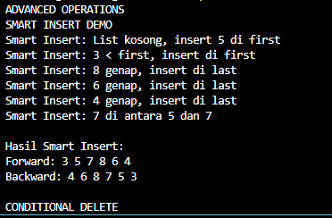

## 1. Nama, NIM, Kelas
- **Nama**: Abisar Fathir
- **NIM**: 103112400068
- **Kelas**: IF-12-05

## 2. Motivasi Belajar Struktur Data
Agar Saya bisa mengaplikasikan materi-materi struktur data ke game yang akan saya buat nanti

## 3. Dasar Teori
Doubly Linked List (DLL) adalah struktur data linear yang tiap elemen (node) menyimpan informasi (info) dan dua pointer: next (ke node berikutnya) dan prev (ke node sebelumnya). Karena arah tautan dua arah, DLL memudahkan operasi penyisipan dan penghapusan pada posisi manapun (awal, akhir, atau tengah) tanpa harus melintasi list dari awal.

Keunggulan DLL:

Akses dua arah (maju & mundur).

Penyisipan/penghapusan pada posisi mana pun relatif mudah (dengan update next dan prev).

Berguna untuk implementasi fitur seperti back/forward history, playlist, dan editor undo/redo.

Kekurangan:

Memakai memori lebih banyak (karena extra pointer prev).

Manajemen pointer lebih rawan bug (misal null dereference) jika tidak hati-hati.

## 4. Guided
### 4.1 Guided 1 (dll_insert.cpp)
Topik: Penyisipan pada Doubly Linked List (insertFirst, insertLast, insertAfter)

Fungsi utama dalam kode:

void insertFirst(List &L, address P) {
    P -> next = L.first;
    P -> prev = Nil;
    if (L.first != Nil) L.first -> prev = P;
    else L.last = P;
    L.first = P;
} Menambah Elemen di awal

void insertLast(List &L, address P) {
    P->prev = L.last;
    P->next = Nil;
    if (L.last != Nil) L.last -> next = P;
    else L.first = P;
    L.last = P;
} Menambah Elemen di akhir

void insertAfter(List &L, address P, address R){
    P -> next = R -> next;
    P -> prev = R;
    if (R -> next != Nil) R -> next -> prev = P;
    else L.last = P;
    R -> next = P;
} menambahkan elemen setelah node tertentu.

address alokasi(infotype x){ // Definisi fungsi alokasi untuk membuat elemen baru
    address P = new elmlist; // Alokasikan memori baru untuk elemen
    P -> info = x;
    P -> next = Nil;
    P -> prev = Nil;
    return P;
} membuat node baru.

void printInfo(List L){
    address P = L.first;
    while (P != Nil) {
        cout << P -> info << " ";
        P = P -> next;
    }
    cout << endl;
} mencetak isi list dari depan ke belakang.
Penjelasan singkat:

Kode ini membentuk list ganda dengan fungsi insert dasar. Modifikasi ditambahkan agar dapat menyisipkan node di posisi sebelum node tertentu dan mencetak dari belakang.

Output yang diharapkan:
![Output]
(image.png)

Muncul daftar elemen (depan ke belakang) dan daftar (belakang ke depan) dengan urutan benar sesuai operasi insert yang dilakukan.

### 4.2 Guided 2 (hapus.cpp)
Topik: Operasi penghapusan pada Doubly Linked List

Fungsi yang ada pada file:

address alokasi(infotype x) {
    address P = new elmlist;
    P -> info = x;
    P -> next = Nil;
    P -> prev = Nil;
    return P;
} membuat node baru.

void dealokasi(address &P) {
    delete P;
    P = Nil;
} membebaskan memory node.

void insertFirst(List &L, address P) {
    P -> next = L.first;
    P -> prev = Nil;
    if (L.first != Nil) L.first -> prev = P;
    else L.last = P;
    L.first = P;
} sisipkan node di depan.

void printInfo(List L){
    address P = L.first;
    while (P != Nil) {
        cout << P -> info << " ";
        P = P -> next;
    }
} cetak isi list dari depan ke belakang.

void deleteFirst(List &L, address &P){
    P = L.first;
    L.first = L.first -> next;
    if (L.first != Nil) L.first -> prev = Nil;
    else L.last = Nil;
    P -> next = Nil;
    P -> prev = Nil;
} hapus node pertama.

void deleteLast(List &L, address &P) {
    P = L.last;
    L.last = L.last -> prev;
    if (L.last != Nil) L.last -> next = Nil; 
    else L.first = Nil;
    P -> prev = Nil;
    P -> next = Nil;
} hapus node terakhir.

void deleteAfter(List &L, address &P, address R) {
    P = R -> next;
    R -> next = P -> next;
    if (P -> next != Nil) P -> next -> prev = R;
    else L.last = R;
    P -> prev = Nil;
    P -> next = Nil;
} hapus node setelah R.

Penjelasan singkat:

Kode menunjukkan bagaimana node dihapus pada berbagai posisi (awal, akhir, tengah). Pointer diperbarui agar list tetap konsisten.

Output yang diharapkan:
![Output]
(image-1.png)

Menampilkan proses penghapusan dan keadaan list setelah tiap operasi.

## 5. Unguided
### 5.1 Unguided 1
Memodifikasi kodingan dll_insert.cpp dan menambahkan dua fungsi baru, yaitu insertBefore() dan printReverse(). Fungsi ini memungkinkan penyisipan elemen sebelum elemen tertentu serta mencetak list dari belakang ke depan.

#include <iostream>
#define Nil NULL
using namespace std;

typedef int infotype;
typedef struct elmlist *address;

struct elmlist {
    infotype info;
    address next;
    address prev;
};

struct List {
    address first;
    address last;
};

address alokasi(infotype x) {
    address P = new elmlist;
    P->info = x;
    P->next = Nil;
    P->prev = Nil;
    return P;
}

void insertFirst(List &L, address P) {
    P->next = L.first;
    P->prev = Nil;
    if (L.first != Nil) L.first->prev = P;
    else L.last = P;
    L.first = P;
}

void insertLast(List &L, address P) {
    P->prev = L.last;
    P->next = Nil;
    if (L.last != Nil) L.last->next = P;
    else L.first = P;
    L.last = P;
}

void insertAfter(List &L, address P, address R) {
    P->next = R->next;
    P->prev = R;
    if (R->next != Nil) R->next->prev = P;
    else L.last = P;
    R->next = P;
}

void insertBefore(List &L, address P, address R) {
    P->next = R;
    P->prev = R->prev;
    if (R->prev != Nil) R->prev->next = P;
    else L.first = P;
    R->prev = P;
}

void printInfo(List L) {
    address P = L.first;
    cout << "List (depan -> belakang): ";
    while (P != Nil) {
        cout << P->info << " ";
        P = P->next;
    }
    cout << endl;
}

void printReverse(List L) {
    address P = L.last;
    cout << "List (belakang -> depan): ";
    while (P != Nil) {
        cout << P->info << " ";
        P = P->prev;
    }
    cout << endl;
}

int main() {
    List L;
    L.first = Nil;
    L.last = Nil;

    address P1 = alokasi(10);
    address P2 = alokasi(20);
    address P3 = alokasi(30);
    address P4 = alokasi(25);

    insertFirst(L, P1);
    insertLast(L, P2);
    insertLast(L, P3);

    cout << "Sebelum insertBefore:" << endl;
    printInfo(L);

    insertBefore(L, P4, P3);
    cout << "Setelah insertBefore (25 sebelum 30):" << endl;
    printInfo(L);

    cout << "Cetak terbalik:" << endl;
    printReverse(L);
} 
Penjelasan Singkat:
insertBefore() mengatur pointer prev dan next agar node baru dapat disisipkan sebelum node target R.
printReverse() menelusuri list dari belakang dengan pointer prev.
Program membuat list [10, 20, 30], lalu menyisipkan 25 sebelum 30, dan menampilkan hasil dalam dua arah (normal & terbalik).

Output:
[Output]
(image-2.png)

### 5.2 Unguided 2
Berikut kode hasil modifikasi file hapus.cpp untuk menambahkan dua fungsi penghapusan baru yaitu deleteByValue() dan deleteAll().

#include <iostream>
cout << "List: ";
while (P != Nil) {
cout << P->info << " ";
P = P->next;
}
cout << endl;
}

void deleteByValue(List &L, infotype x) {
address P = L.first;
while (P != Nil && P->info != x) {
P = P->next;
}
if (P == Nil) {
cout << "Data " << x << " tidak ditemukan." << endl;
return;
}

if (P == L.first) {
L.first = P->next;
if (L.first != Nil) L.first->prev = Nil;
else L.last = Nil;
} else if (P == L.last) {
L.last = P->prev;
L.last->next = Nil;
} else {
P->prev->next = P->next;
P->next->prev = P->prev;
}

cout << "Menghapus data: " << x << endl;
dealokasi(P);
}

void deleteAll(List &L) {
address P = L.first;
int count = 0;
while (P != Nil) {
address temp = P;
P = P->next;
dealokasi(temp);
count++;
}
L.first = Nil;
L.last = Nil;
cout << "Semua elemen dihapus (" << count << " data)." << endl;
}

int main() {
List L;
L.first = Nil;
L.last = Nil;

insertFirst(L, alokasi(10));
insertFirst(L, alokasi(20));
insertFirst(L, alokasi(30));

cout << "List awal: ";
printInfo(L);

deleteByValue(L, 20);
cout << "Setelah deleteByValue(20): ";
printInfo(L);

deleteAll(L);
cout << "Setelah deleteAll: ";
printInfo(L);
}
Penjelasan :
Fungsi deleteByValue() mencari node pertama dengan nilai tertentu (x) dan menghapusnya dengan menyesuaikan pointer prev dan next di sekitarnya. Jika node yang dihapus ada di awal atau akhir list, maka pointer first atau last juga diperbarui agar struktur list tetap konsisten. Jika data tidak ditemukan, program menampilkan pesan “Data tidak ditemukan.”
Sementara itu, deleteAll() menghapus seluruh elemen list satu per satu menggunakan loop, melakukan dealokasi pada setiap node, lalu menyetel first dan last menjadi Nil untuk menandakan list kosong. Di akhir, program menampilkan jumlah elemen yang berhasil dihapus.

Output:
![Output]
(image-3.png)

### 5.3 Unguided 3
Function tambahan yaitu smartInsert() dan conditionalDelete() sesuai soal praktikum. Fungsi ini menunjukkan kemampuan logika bercabang dan kondisi kompleks dalam Doubly Linked List.
[
#include <iostream>
#define Nil NULL
using namespace std;

typedef int infotype;
typedef struct elmlist *address;

struct elmlist {
    infotype info;
    address next;
    address prev;
};

struct List {
    address first;
    address last;
};

address alokasi(infotype x) {
    address P = new elmlist;
    P->info = x;
    P->next = Nil;
    P->prev = Nil;
    return P;
}

void dealokasi(address &P) {
    delete P;
    P = Nil;
}

void createList(List &L) {
    L.first = Nil;
    L.last = Nil;
}

void insertFirst(List &L, address P) {
    P->next = L.first;
    P->prev = Nil;
    if (L.first != Nil) L.first->prev = P;
    else L.last = P;
    L.first = P;
}

void insertLast(List &L, address P) {
    P->prev = L.last;
    P->next = Nil;
    if (L.last != Nil) L.last->next = P;
    else L.first = P;
    L.last = P;
}

void printInfo(List L) {
    if (L.first == Nil) {
        cout << "List kosong." << endl;
        return;
    }
    address P = L.first;
    cout << "List: ";
    while (P != Nil) {
        cout << P->info << " ";
        P = P->next;
    }
    cout << endl;
}

void smartInsert(List &L, infotype x) {
    address P = alokasi(x);
    cout << ">> Menyisipkan " << x << "..." << endl;

    if (L.first == Nil) {
        cout << "List kosong, memasukkan " << x << " sebagai elemen pertama." << endl;
        insertFirst(L, P);
    } 
    else if (x < L.first->info) {
        cout << x << " lebih kecil dari elemen pertama, disisipkan di depan." << endl;
        insertFirst(L, P);
    } 
    else if (x > L.last->info) {
        cout << x << " lebih besar dari elemen terakhir, disisipkan di akhir." << endl;
        insertLast(L, P);
    } 
    else {
        address Q = L.first;
        while (Q != Nil && Q->info < x) Q = Q->next;

        if (Q != Nil && Q->info == x) {
            cout << "Nilai " << x << " sudah ada, tidak disisipkan (hindari duplikat)." << endl;
            dealokasi(P);
            return;
        }

        P->next = Q;
        P->prev = Q->prev;
        Q->prev->next = P;
        Q->prev = P;

        cout << x << " disisipkan sebelum elemen " << Q->info << endl;
    }
}

void conditionalDelete(List &L, infotype batas) {
    cout << ">> Menghapus semua elemen dengan nilai lebih besar dari " << batas << endl;
    address P = L.first;
    int count = 0;

    while (P != Nil) {
        address temp = P;
        P = P->next;
        if (temp->info > batas) {
            cout << "Menghapus " << temp->info << endl;

            if (temp == L.first) {
                L.first = temp->next;
                if (L.first != Nil) L.first->prev = Nil;
                else L.last = Nil;
            } else if (temp == L.last) {
                L.last = temp->prev;
                if (L.last != Nil) L.last->next = Nil;
            } else {
                temp->prev->next = temp->next;
                temp->next->prev = temp->prev;
            }
            dealokasi(temp);
            count++;
        }
    }

    cout << "Total elemen yang dihapus: " << count << endl;
}

int main() {
    List L;
    createList(L);

    smartInsert(L, 50);
    smartInsert(L, 20);
    smartInsert(L, 70);
    smartInsert(L, 40);
    smartInsert(L, 60);
    smartInsert(L, 70); 
    printInfo(L);

    conditionalDelete(L, 50);
    printInfo(L);
}
Penjelasan :
smartInsert() menambahkan elemen secara terurut dengan kondisi kompleks (kosong, di depan, di belakang, duplikat, atau di tengah).
conditionalDelete() menghapus semua node dengan nilai lebih besar dari parameter `batas` dan menampilkan jumlah elemen yang dihapus.
Program ini menampilkan semua proses penyisipan dan penghapusan secara informatif di konsol.
Output:

]

## 6. Kesimpulan
[Melalui latihan ini, praktikan memahami operasi dasar dan lanjutan pada Doubly Linked List: alokasi, dealkokasi, insertFirst/Last/After/Before, deleteFirst/Last/After/ByValue/All, serta cara mencetak list dari dua arah. Fungsi smartInsert dan conditionalDelete melatih penerapan logika bercabang serta penanganan edge-case dalam pengelolaan data.]

## 7. Referensi
Ramadhana, Ilmi, and Bambang Sujatmiko. "Pengembangan Aplikasi Kamus Bahasa Pemrograman C++ Berbasis Android Untuk Meningkatkan Kompetensi Kognitif Mata Kuliah Struktur Data." IT-Edu: Jurnal Information Technology and Education 3.1 (2018). https://doi.org/10.26740/it-edu.v3i1.24755

Anita Sindar, R. M. S. Struktur Data Dan Algoritma Dengan C++. Vol. 1. CV. AA. RIZKY, 2019. https://books.google.com/books?hl=id&lr=&id=GP_ADwAAQBAJ&oi=fnd&pg=PA23&dq=c%2B%2B+struktur+data&ots=86j8RlZQeV&sig=l0bNTnoJd9vDNJT69nmFF3c_GZA