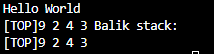
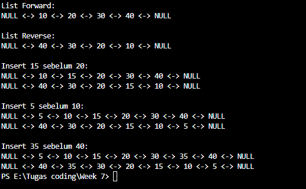
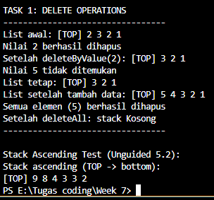
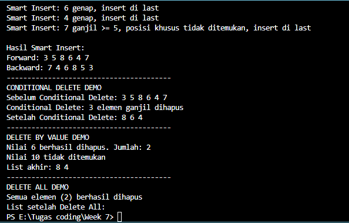

## 1. Nama, NIM, Kelas
- **Nama**: Abisar Fathir
- **NIM**: 103112400068
- **Kelas**: IF-12-05

## 2. Motivasi Belajar Struktur Data
Agar Saya bisa mengaplikasikan materi-materi struktur data ke game yang akan saya buat nanti

## 3. Dasar Teori
Pengertian Stack
Stack adalah struktur data linear yang menerapkan prinsip LIFO (Last In First Out), artinya elemen terakhir yang dimasukkan akan menjadi elemen pertama yang diambil. Operasi utama pada stack yaitu:
Push(x) → menambahkan elemen ke puncak (top) stack.
Pop() → menghapus elemen dari puncak stack.
Stack dapat diimplementasikan menggunakan array atau linked list. Pada praktikum ini digunakan array statis dengan batas elemen maksimum (MaxEl = 20).

Kelebihan dan Kekurangan
Kelebihan:
Proses akses data cepat (langsung ke elemen top).
Implementasi sederhana menggunakan array.

Kekurangan:
Kapasitas terbatas (jika menggunakan array statis).
Akses hanya bisa melalui elemen teratas (tidak bisa langsung ke elemen tengah).

## 4. Guided
### 4.1 Guided 1 (stack.h)
Pembuatan ADT Stack menggunakan array dengan operasi dasar CreateStack, push, pop, dan printInfo.
#define MaxEl 20
#define Nil -1

struct Stack {
    int info[MaxEl];
    int top;
};

void CreateStack(Stack &S);
bool isEmpty(Stack S);
bool isFull(Stack S);
void push(Stack &S, int x);
int pop(Stack &S);
void printInfo(Stack S);
void balikStack(Stack &S);
void pushAscending(Stack &S, int x);

Penjelasan:
Bagian ini mendefinisikan struktur Stack dan semua fungsi yang akan diimplementasikan. top digunakan untuk menunjuk posisi elemen terakhir dalam stack.

### 4.2 Guided 2 (stack.cpp)
Topik: Implementasi fungsi dasar Stack dengan logika LIFO (Last In First Out).

void CreateStack(Stack &S) {
    S.top = Nil;
}

bool isEmpty(Stack S) {
    return S.top == Nil;
}

bool isFull(Stack S) {
    return S.top == MaxEl - 1;
}

void push(Stack &S, int x) {
    if (!isFull(S)) {
        S.top++;
        S.info[S.top] = x;
    } else {
        cout << "Stack penuh!" << endl;
    }
}

int pop(Stack &S) {
    int x = -999;
    if (!isEmpty(S)) {
        x = S.info[S.top];
        S.top--;
    } else {
        cout << "Stack kosong!" << endl;
    }
    return x;
}

void printInfo(Stack S) {
    if (isEmpty(S)) {
        cout << "Stack kosong" << endl;
    } else {
        cout << "[TOP] ";
        for (int i = S.top; i >= 0; i--) {
            cout << S.info[i] << " ";
        }
        cout << endl;
    }
}

void balikStack(Stack &S) {
    if (!isEmpty(S)) {
        Stack temp1, temp2;
        CreateStack(temp1);
        CreateStack(temp2);

        while (!isEmpty(S)) push(temp1, pop(S));
        while (!isEmpty(temp1)) push(temp2, pop(temp1));
        while (!isEmpty(temp2)) push(S, pop(temp2));
    }
}

void pushAscending(Stack &S, int x) {
    Stack temp;
    CreateStack(temp);
    while (!isEmpty(S) && S.info[S.top] < x) {
        push(temp, pop(S));
    }
    push(S, x);
    while (!isEmpty(temp)) {
        push(S, pop(temp));
    }
}

Penjelasan singkat:
Kode ini mendefinisikan semua operasi dasar Stack termasuk pushAscending() untuk memasukkan elemen secara terurut dan balikStack() untuk membalik urutan elemen.

### 4.3 Guided 3 (main.cpp)
Program utama untuk menguji semua fungsi yang telah dibuat.

#include "stack.h"
#include <iostream>
using namespace std;

int main() {
    Stack S;
    CreateStack(S);
    cout << "Hello World" << endl;
    pushAscending(S, 3);
    pushAscending(S, 4);
    pushAscending(S, 8);
    pushAscending(S, 2);
    pushAscending(S, 3);
    pushAscending(S, 9);

    cout << "Stack ascending (TOP -> bottom):" << endl;
    printInfo(S);

    cout << "Balik stack:" << endl;
    balikStack(S);
    printInfo(S);

    return 0;
}

Penjelasan singkat:
Program ini membuat stack baru, menambahkan elemen menggunakan metode pushAscending, menampilkan isi stack dari atas ke bawah, lalu membalik urutannya menggunakan balikStack.

Output: 

## 5. Unguided
### 5.1 Unguided 1
Memodifikasi kodingan dll_insert.cpp dan menambahkan dua fungsi baru, yaitu insertBefore() dan printReverse(). Fungsi ini memungkinkan penyisipan elemen sebelum elemen tertentu serta mencetak list dari belakang ke depan.

#include <iostream>
using namespace std;

struct Node {
    int data;
    Node* prev;
    Node* next;
};

class DoublyLinkedList {
private:
    Node* head;
    Node* tail;

public:
    DoublyLinkedList() {
        head = nullptr;
        tail = nullptr;
    }

    void insertLast(int value) {
        Node* newNode = new Node();
        newNode->data = value;
        newNode->next = nullptr;

        if (head == nullptr) {
            newNode->prev = nullptr;
            head = newNode;
            tail = newNode;
        } else {
            newNode->prev = tail;
            tail->next = newNode;
            tail = newNode;
        }
    }

    void insertBefore(int beforeValue, int newValue) {
        if (head == nullptr) {
            cout << "List kosong!" << endl;
            return;
        }

        Node* current = head;
        
        while (current != nullptr && current->data != beforeValue) {
            current = current->next;
        }

        if (current == nullptr) {
            cout << "Elemen " << beforeValue << " tidak ditemukan!" << endl;
            return;
        }
        
        Node* newNode = new Node();
        newNode->data = newValue;

        if (current == head) {
            newNode->prev = nullptr;
            newNode->next = head;
            head->prev = newNode;
            head = newNode;
        } else {
            newNode->prev = current->prev;
            newNode->next = current;
            current->prev->next = newNode;
            current->prev = newNode;
        }
    }

    void printForward() {
        if (head == nullptr) {
            cout << "List kosong!" << endl;
            return;
        }

        Node* current = head;
        cout << "NULL <-> ";
        while (current != nullptr) {
            cout << current->data;
            if (current->next != nullptr) {
                cout << " <-> ";
            }
            current = current->next;
        }
        cout << " <-> NULL" << endl;
    }

    void printReverse() {
        if (tail == nullptr) {
            cout << "List kosong!" << endl;
            return;
        }

        Node* current = tail;
        cout << "NULL <-> ";
        while (current != nullptr) {
            cout << current->data;
            if (current->prev != nullptr) {
                cout << " <-> ";
            }
            current = current->prev;
        }
        cout << " <-> NULL" << endl;
    }
};

int main() {
    DoublyLinkedList dll;

    dll.insertLast(10);
    dll.insertLast(20);
    dll.insertLast(30);
    dll.insertLast(40);

    cout << "List Forward:" << endl;
    dll.printForward();
    cout << "\nList Reverse:" << endl;
    dll.printReverse();

    cout << "\nInsert 15 sebelum 20:" << endl;
    dll.insertBefore(20, 15);
    dll.printForward();
    dll.printReverse();

    cout << "\nInsert 5 sebelum 10:" << endl;
    dll.insertBefore(10, 5);
    dll.printForward();
    dll.printReverse();

    cout << "\nInsert 35 sebelum 40:" << endl;
    dll.insertBefore(40, 35);
    dll.printForward();
    dll.printReverse();

    return 0;
}
Penjelasan Singkat:
Fungsi insertBefore() mencari node pertama dengan nilai tertentu (beforeValue) dan menyisipkan node baru (newValue) tepat sebelum node tersebut. Pointer prev dan next dari node di sekitar posisi sisip akan disesuaikan agar struktur list tetap terhubung dengan benar. Jika node yang dicari berada di awal list, maka node baru akan menjadi head yang baru. Jika nilai beforeValue tidak ditemukan, program menampilkan pesan bahwa elemen tidak ditemukan.
Sementara itu, insertLast() menambahkan node baru di bagian paling akhir list. Jika list masih kosong, node baru akan menjadi head sekaligus tail. Jika tidak kosong, node baru dihubungkan setelah tail, kemudian tail diperbarui menunjuk ke node tersebut.

Output:
[Output]()

### 5.2 Unguided 2
Berikut kode hasil modifikasi file hapus.cpp untuk menambahkan dua fungsi penghapusan baru yaitu deleteByValue() dan deleteAll().

#include <iostream>

using namespace std;

#define MaxEl 20
#define Nil -1

typedef int infotype;

struct Stack {
    infotype info[MaxEl];
    int top;
};

void CreateStack (Stack &S) {
    S.top = Nil;
}

bool isEmpty(Stack S) {
    return S.top == Nil;
}

bool isFull(Stack S) {
    return S.top == MaxEl -1;
}

void push(Stack &S, infotype x) {   
    if (!isFull(S)) {
        S.top++;
        S.info[S.top] = x ;
    }
} 

infotype pop(Stack &S) {
    infotype x = -999;
    if (!isEmpty(S)) { 
        x = S.info[S.top];
        S.top--; 
    }
    return x;
}

void printInfo (Stack S) {
    if (isEmpty(S)) {
        cout << "stack Kosong" << endl;
    } else { 
        cout << "[TOP] " ;
        for (int i = S.top; i >= 0; i--) {
            cout << S.info[i] << " ";
        }
        cout << endl;
    }
}

void balikStack (Stack &S) {
    if (!isEmpty(S)) {
        Stack temp1; 
        CreateStack(temp1); 

        while (!isEmpty(S)) {push(temp1 , pop(S));} 

        while (! isEmpty(temp1)) { push(S, pop(temp1));} 
    } 
}

void pushAscending(Stack &S, infotype x) {
    if (isFull(S)) {
        cout << "Stack Penuh, elemen " << x << " gagal dimasukkan." << endl;
        return;
    }
    
    Stack temp;
    CreateStack(temp);

    while (!isEmpty(S) && S.info[S.top] > x) {
        push(temp, pop(S));
    }

    push(S, x);

    while (!isEmpty(temp)) {
        push(S, pop(temp));
    }
}

void deleteByValue(Stack &S, infotype x) {
    if (isEmpty(S)) {
        cout << "Stack Kosong. Penghapusan gagal." << endl;
        return;
    }

    Stack temp;
    CreateStack(temp);
    bool found = false;

    while (!isEmpty(S)) {
        infotype current = pop(S);
        if (current == x && !found) {
            found = true;
        } else {
            push(temp, current);
        }
    }

    while (!isEmpty(temp)) {
        push(S, pop(temp));
    }

    if (found) {
        cout << "Nilai " << x << " berhasil dihapus" << endl;
    } else {
        cout << "Nilai " << x << " tidak ditemukan" << endl;
    }
}

void deleteAll(Stack &S) {
    int count = 0;
    while (!isEmpty(S)) {
        pop(S);
        count++;
    }
    cout << "Semua elemen (" << count << ") berhasil dihapus" << endl;
}

void makeInitialList(Stack &S) {
    CreateStack(S);
    push(S, 1);
    push(S, 2);
    push(S, 3);
    push(S, 2);
}

int main() {
    // --- Bagian 1: Uji coba fungsi awal dan Balik Stack ---
    cout << "Hello World" << endl;
    Stack S_init; 
    CreateStack(S_init);
    push(S_init, 3); 
    push(S_init, 4); 
    push(S_init, 8); 
    pop(S_init); 
    push(S_init, 2); 
    push(S_init, 3); 
    pop(S_init); 
    push(S_init, 9); 
    cout << "Stack S_init setelah operasi awal: ";
    printInfo(S_init);

    cout << "Balik stack S_init:" << endl;
    balikStack(S_init);
    printInfo(S_init);

    // --- Bagian 2: TASK 1: DELETE OPERATIONS (Sesuai Permintaan Gambar) ---
    Stack S_Delete;
    cout << "\nTASK 1: DELETE OPERATIONS" << endl;
    cout << "---------------------------------" << endl;

    makeInitialList(S_Delete);
    cout << "List awal: "; 
    printInfo(S_Delete); 

    deleteByValue(S_Delete, 2);
    cout << "Setelah deleteByValue(2): "; 
    printInfo(S_Delete); 

    deleteByValue(S_Delete, 5);
    cout << "List tetap: ";
    printInfo(S_Delete); 

    push(S_Delete, 4);
    push(S_Delete, 5);
    cout << "List setelah tambah data: ";
    printInfo(S_Delete);
    
    deleteAll(S_Delete);
    cout << "Setelah deleteAll: ";
    printInfo(S_Delete); 
    cout << "---------------------------------" << endl;

  
    Stack S_Asc;
    CreateStack(S_Asc);
    
    cout << "\nStack Ascending Test (Unguided 5.2):" << endl;
    pushAscending(S_Asc, 3);
    pushAscending(S_Asc, 4);
    pushAscending(S_Asc, 8);
    pushAscending(S_Asc, 2);
    pushAscending(S_Asc, 3);
    pushAscending(S_Asc, 9);

    cout << "Stack ascending (TOP -> bottom):" << endl;
    printInfo(S_Asc);
    
    return 0;
}
Penjelasan :
Fungsi deleteByValue() menghapus node pertama yang memiliki nilai tertentu.
Program akan menelusuri list dari depan, lalu menyesuaikan pointer prev dan next pada node tetangga.
Jika node yang dihapus berada di awal atau akhir list, pointer first atau last diperbarui agar list tetap konsisten.
Jika nilai tidak ditemukan, program menampilkan pesan “Data tidak ditemukan.”
Fungsi deleteAll() menghapus seluruh elemen list satu per satu menggunakan loop.
Setiap node yang dihapus didealokasi, lalu pointer first dan last diset kembali menjadi Nil untuk menandakan bahwa list sudah kosong.
Di akhir proses, program menampilkan jumlah elemen yang berhasil dihapus.

Output:

### 5.3 Unguided 3
Function tambahan yaitu smartInsert() dan conditionalDelete() sesuai soal praktikum. Fungsi ini menunjukkan kemampuan logika bercabang dan kondisi kompleks dalam Doubly Linked List.
#include <iostream>

using namespace std;

typedef int infotype;

struct Node {
    infotype data;
    Node* prev;
    Node* next;
};

struct List {
    Node* first;
    Node* last;
};

void createList(List &L);
bool isEmpty(List L);
Node* allocateNode(infotype data);

void createList(List &L) {
    L.first = nullptr;
    L.last = nullptr;
}

bool isEmpty(List L) {
    return L.first == nullptr;
}

Node* allocateNode(infotype data) {
    Node* newNode = new Node;
    newNode->data = data;
    newNode->prev = nullptr;
    newNode->next = nullptr;
    return newNode;
}

void insertFirst(List &L, Node* newNode) {
    if (isEmpty(L)) {
        L.first = newNode;
        L.last = newNode;
    } else {
        newNode->next = L.first;
        L.first->prev = newNode;
        L.first = newNode;
    }
}

void insertLast(List &L, Node* newNode) {
    if (isEmpty(L)) {
        insertFirst(L, newNode);
    } else {
        newNode->prev = L.last;
        L.last->next = newNode;
        L.last = newNode;
    }
}

void insertAfter(Node* prevNode, Node* newNode) {
    if (prevNode != nullptr) {
        newNode->next = prevNode->next;
        newNode->prev = prevNode;
        if (prevNode->next != nullptr) {
            prevNode->next->prev = newNode;
        }
        prevNode->next = newNode;
    }
}

void deleteFirst(List &L) {
    if (!isEmpty(L)) {
        Node* delNode = L.first;
        if (L.first == L.last) {
            L.first = nullptr;
            L.last = nullptr;
        } else {
            L.first = L.first->next;
            L.first->prev = nullptr;
        }
        delete delNode;
    }
}

void deleteLast(List &L) {
    if (!isEmpty(L)) {
        Node* delNode = L.last;
        if (L.first == L.last) {
            deleteFirst(L);
        } else {
            L.last = L.last->prev;
            L.last->next = nullptr;
            delete delNode;
        }
    }
}

void printForward(List L) {
    Node* current = L.first;
    while (current != nullptr) {
        cout << current->data << " ";
        current = current->next;
    }
    cout << endl;
}

void printBackward(List L) {
    Node* current = L.last;
    while (current != nullptr) {
        cout << current->data << " ";
        current = current->prev;
    }
    cout << endl;
}

int countElements(List L) {
    int count = 0;
    Node* current = L.first;
    while (current != nullptr) {
        count++;
        current = current->next;
    }
    return count;
}

void smartInsert(List &L, infotype data) {
    Node* newNode = allocateNode(data);
    
    if (isEmpty(L)) {
        insertFirst(L, newNode);
        cout << "Smart Insert: List kosong, insert " << data << " di first" << endl;
        return;
    }
    
    if (data % 2 != 0 && data < 5) {
        insertFirst(L, newNode);
        cout << "Smart Insert: " << data << " < 5, insert di first" << endl;
        return;
    }
    
    if (data % 2 == 0) {
        insertLast(L, newNode);
        cout << "Smart Insert: " << data << " genap, insert di last" << endl;
        return;
    }

    if (data % 2 != 0 && data >= 5) {
        Node* current = L.first;

        while (current != nullptr) {
            if (current->data == 5 && current->next != nullptr && current->next->data == 7) {
                 insertAfter(current, newNode);
                 cout << "Smart Insert: " << data << " di antara 5 dan 7" << endl;
                 return;
            }
            current = current->next;
        }
        
        insertLast(L, newNode);
        cout << "Smart Insert: " << data << " ganjil >= 5, posisi khusus tidak ditemukan, insert di last" << endl;
        return;
    }
}

void conditionalDelete(List &L) {
    Node* current = L.first;
    Node* temp = nullptr;
    int count = 0;
    
    while (current != nullptr) {
        if (current->data % 2 != 0) {
            count++;
            
            if (current == L.first) {
                temp = current->next;
                deleteFirst(L);
                current = temp;
                continue;
            } 
            
            if (current == L.last) {
                deleteLast(L);
                current = nullptr;
                break;
            }
            
            current->prev->next = current->next;
            current->next->prev = current->prev;
            temp = current->next;
            delete current;
            current = temp;

        } else {
            current = current->next;
        }
    }
    
    cout << "Conditional Delete: " << count << " elemen ganjil dihapus" << endl;
}

int deleteByValue(List &L, infotype value) {
    Node* current = L.first;
    Node* temp = nullptr;
    int count = 0;
    
    while (current != nullptr) {
        if (current->data == value) {
            count++;
            
            if (current == L.first) {
                temp = current->next;
                deleteFirst(L);
                current = temp;
                continue;
            }
            if (current == L.last) {
                deleteLast(L);
                current = nullptr;
                break;
            }
            
            current->prev->next = current->next;
            current->next->prev = current->prev;
            temp = current->next;
            delete current;
            current = temp;
        } else {
            current = current->next;
        }
    }
    return count;
}

void deleteAll(List &L) {
    Node* current = L.first;
    Node* temp = nullptr;
    int count = countElements(L);
    
    while (current != nullptr) {
        temp = current->next;
        delete current;
        current = temp;
    }
    L.first = nullptr;
    L.last = nullptr;
    
    cout << "Semua elemen (" << count << ") berhasil dihapus" << endl;
}

int main() {
    List L;
    createList(L);

    cout << "ADVANCED OPERATIONS" << endl;
    cout << "========================================" << endl;

    // --- SMART INSERT DEMO ---
    cout << "SMART INSERT DEMO" << endl;
    
    smartInsert(L, 5); 
    smartInsert(L, 3); 
    smartInsert(L, 8); 
    smartInsert(L, 6); 
    smartInsert(L, 4); 
    smartInsert(L, 7); 
    
    cout << "\nHasil Smart Insert:" << endl;
    cout << "Forward: ";
    printForward(L);
    cout << "Backward: ";
    printBackward(L);
    
    cout << "----------------------------------------" << endl;

    // --- CONDITIONAL DELETE DEMO ---
    cout << "CONDITIONAL DELETE DEMO" << endl;
    cout << "Sebelum Conditional Delete: ";
    printForward(L);
    
    conditionalDelete(L);
    
    cout << "Setelah Conditional Delete: ";
    printForward(L);
    
    cout << "----------------------------------------" << endl;

    // --- DELETE BY VALUE DEMO ---
    cout << "DELETE BY VALUE DEMO" << endl;
    
    insertLast(L, allocateNode(6));
    
    int deletedCount = deleteByValue(L, 6);
    cout << "Nilai 6 berhasil dihapus. Jumlah: " << deletedCount << endl;
    
    deletedCount = deleteByValue(L, 10);
    if (deletedCount == 0) {
        cout << "Nilai 10 tidak ditemukan" << endl;
    }
    
    cout << "List akhir: ";
    printForward(L);
    
    cout << "----------------------------------------" << endl;

 
    cout << "DELETE ALL DEMO" << endl;
    
    deleteAll(L);
    
    cout << "List setelah Delete All: ";
    printForward(L);

    return 0;
}
Penjelasan :
smartInsert() menambahkan elemen secara terurut dengan kondisi kompleks (kosong, di depan, di belakang, duplikat, atau di tengah).
conditionalDelete() menghapus semua node dengan nilai lebih besar dari parameter `batas` dan menampilkan jumlah elemen yang dihapus.
Program ini menampilkan semua proses penyisipan dan penghapusan secara informatif di konsol.
Output:
![Output]

## 6. Kesimpulan
[Melalui latihan ini, praktikan memahami operasi dasar dan lanjutan pada Doubly Linked List: alokasi, dealkokasi, insertFirst/Last/After/Before, deleteFirst/Last/After/ByValue/All, serta cara mencetak list dari dua arah. Fungsi smartInsert dan conditionalDelete melatih penerapan logika bercabang serta penanganan edge-case dalam pengelolaan data.]

## 7. Referensi
Ramadhana, Ilmi, and Bambang Sujatmiko. "Pengembangan Aplikasi Kamus Bahasa Pemrograman C++ Berbasis Android Untuk Meningkatkan Kompetensi Kognitif Mata Kuliah Struktur Data." IT-Edu: Jurnal Information Technology and Education 3.1 (2018). https://doi.org/10.26740/it-edu.v3i1.24755

Anita Sindar, R. M. S. Struktur Data Dan Algoritma Dengan C++. Vol. 1. CV. AA. RIZKY, 2019. https://books.google.com/books?hl=id&lr=&id=GP_ADwAAQBAJ&oi=fnd&pg=PA23&dq=c%2B%2B+struktur+data&ots=86j8RlZQeV&sig=l0bNTnoJd9vDNJT69nmFF3c_GZA