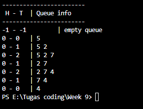
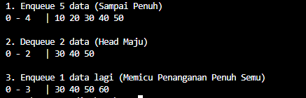
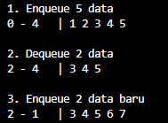

## 1. Nama, NIM, Kelas
- **Nama**: Abisar Fathir
- **NIM**: 103112400068
- **Kelas**: IF-12-05

## 2. Motivasi Belajar Struktur Data
Agar Saya bisa mengaplikasikan materi-materi struktur data ke game yang akan saya buat nanti

## 3. Dasar Teori
A. DASAR TEORI
1. Pengertian Queue (Antrian) Queue (dibaca: kyu) adalah struktur data yang merepresentasikan sebuah antrian, di mana elemen data diatur secara berurutan. Prinsip utama yang digunakan dalam Queue adalah FIFO (First In, First Out). Artinya, elemen yang pertama kali masuk ke dalam antrian akan menjadi elemen yang pertama kali dilayani atau dikeluarkan.

2. Operasi Utama Queue Terdapat dua operasi dasar dalam Queue:
Enqueue (Insert): Proses menambahkan elemen baru ke dalam antrian. Operasi ini selalu dilakukan di posisi belakang atau Tail.
Dequeue (Delete): Proses mengambil atau menghapus elemen dari antrian. Operasi ini selalu dilakukan di posisi depan atau Head.

3. Implementasi Menggunakan Array (Tabel) Dalam representasi menggunakan array, Queue memiliki keterbatasan jumlah elemen (maksimum) karena ukuran array sudah ditentukan di awal. Terdapat beberapa metode pengelolaan indeks Head dan Tail dalam array:
Alternatif 1 (Head Diam): Head selalu berada di indeks awal (0). Setiap kali ada penghapusan elemen (dequeue), seluruh elemen di belakangnya harus digeser maju.
Alternatif 2 (Head Bergerak): Head ikut bergerak maju saat dequeue. Metode ini lebih cepat karena tidak ada pergeseran, namun dapat menyebabkan kondisi "Penuh Semu" (pseudo-full), di mana antrian dianggap penuh padahal masih ada ruang kosong di indeks awal.
Alternatif 3 (Circular/Berputar): Head dan Tail bergerak memutar menggunakan operasi modulus. Jika indeks mencapai batas maksimum, ia akan kembali ke indeks 0. Ini adalah metode paling efisien karena memanfaatkan ruang memori secara optimal tanpa pergeseran data.

## 4. Guided
### 4.1 Guided 1 (queue.h)
Pembuatan ADT Stack menggunakan array dengan operasi dasar CreateStack, push, pop, dan printInfo.
#ifndef QUEUE_H
#define QUEUE_H
#define max_QUEUE 5
struct QUEUE{
    int info[max_QUEUE];
    int head;
    int tail;
    
};
void createQueue(QUEUE &Q);
bool isEmpty(QUEUE Q);
bool isFull(QUEUE Q);
void enqueue(QUEUE&Q, int x);
int dequeue(QUEUE &Q);
void printInfo(QUEUE Q);
#endif

Penjelasan:
Bagian ini berfungsi sebagai header file yang mendefinisikan tipe data yang ada dari queue serta variabel head and tail sebagai petunjuk posisi antrian. file ini jg memuat fungsi fungsi operasional sepertienqueue, dequeue, dan printInfo, yang bertindak sebagai antarmuka (interface) agar fungsi tersebut dapat dikenali dan dipanggil oleh file utama (main.cpp) dan untuk codingan (queue.cpp). 

### 4.2 Guided 2 (queue.cpp)
Topik: Implementasi fungsi dasar Stack dengan logika LIFO (Last In First Out).

#include "queue.h"
#include <iostream>

using namespace std;

void createQueue(QUEUE &Q) {
    Q.head = 0;
    Q.tail = 0;
    Q.count = 0;
}

bool isEmpty(QUEUE Q) {
    return Q.count == 0;
}

bool isFUll(QUEUE Q) {
    return Q.count == max_QUEUE;
}

void enqueue(QUEUE &Q, int x) {
    if(!isFull(Q)){
        Q.info[Q.tail] = x;

        Q.tail =(Q.tail + 1) % max_QUEUE;
        Q.count ++; 
    } else {
        cout << "ANtrian Penuh!" << endl;
    }
}

int dequeue(QUEUE &Q) {
    if(!isEmpty(Q)){
    int x = Q.info[Q.head];
    //(head)
    Q.head = (Q.head + 1) % max_QUEUE;
    Q.count --;
    return x;
} else {
    cout << "Antrean kosong!" << endl;
    return -1;
}
}

void printInfo(QUEUE Q) {
    cout << "isi QUeue: [";
    if (!isEmpty(Q)) {
        int i = Q.head;
        int n = 0; 
        while (n < Q.count){
            cout << Q.info[i] << "";
            i = (i + 1) % max_QUEUE;
            n++;
        }
    }
    cout << "l"<< endl;
}

Penjelasan Singkat:
Codingan ini menerapkan mekanisme Circular Queue (antrian melingkar) yang dimodifikasi dengan penambahan variabel count. Variabel ini berfungsi khusus untuk menghitung jumlah total elemen yang ada di dalam antrian secara real-time.
Fungsi enqueue() memasukkan data dengan memajukan tail secara memutar ((tail + 1) % max) dan menambahkan nilai count. Sebaliknya, dequeue() mengambil data dengan memajukan head secara memutar dan mengurangi nilai count. Keunggulan utama metode ini adalah kemudahannya dalam menentukan status antrian: kondisi "Penuh" cukup dicek jika count == max_QUEUE, dan kondisi "Kosong" jika count == 0, sehingga tidak memerlukan rumus matematika indeks yang rumit untuk membedakan status penuh atau kosong.

### 4.3 Guided 3 (main.cpp)
Program utama untuk menguji semua fungsi yang telah dibuat.

#include <iostream>
#include "queue.h"

using namespace std;

int main(){
    QUEUE Q;
    createQueue(Q);
    printInfo(Q);

    cout << "\n Enqueue 3 elemen" << endl;
    enqueue(Q, 5);
    printInfo(Q);
    enqueue(Q,2); 
    printInfo(Q);
    enqueue(Q,7);
    printInfo(Q);

    cout << "\n dequeue 1 Elemen" << endl;
    cout << "elemen keluar:" << dequeue(Q) << endl;
    printInfo(Q);

    cout << "\n Enqueue 1 elemen" << endl;
    enqueue(Q, 4);
    printInfo(Q);

    cout << "\nDequeue 2 elemen" << endl;
    cout << "elemen keluar:" << dequeue(Q) << endl;
    cout << "elemen keluar:" <<dequeue <<endl;
    printInfo(Q);
    return 0;
}

Penjelasan Singkat:
File ini berfungsi sebagai program penggerak (driver code) untuk menguji apakah struktur data Queue yang telah dibuat berfungsi dengan benar. Di dalamnya dilakukan serangkaian simulasi operasi antrian, mulai dari inisialisasi (createQueue), memasukkan beberapa data berturut-turut (enqueue), hingga mengeluarkan data (dequeue). Program ini menampilkan status antrian ke layar di setiap langkahnya menggunakan fungsi printInfo agar pengguna dapat memverifikasi bahwa urutan data yang masuk dan keluar sudah sesuai dengan prinsip FIFO (First-In, First-Out) serta memastikan penghitungan jumlah elemen (count) berjalan akurat.

## 5. Unguided
### 5.1 Unguided 1
Implementasi ADT Queue pada file Queue.cpp dengan menerapkan Mekanisme Queue Alternatif 2 (head bergerak, tail bergerak)
#include "queue.h"
#include <iostream>

using namespace std;

void createQueue(QUEUE &Q) {
    Q.head = -1;
    Q.tail = -1;
}

bool isEmptyQueue(QUEUE Q) {
    return Q.head == -1;
}

bool isFullQueue(QUEUE Q) {
    return Q.tail == max_QUEUE - 1;
}

void enqueue(QUEUE &Q, int x) {
    if (!isFullQueue(Q)) {
        if (isEmptyQueue(Q)) {
            Q.head = 0;
            Q.tail = 0;
            Q.info[0] = x;
        } else {
            Q.tail++;
            Q.info[Q.tail] = x;
        }
    } else {
        cout << "Antrian Penuh!" << endl;
    }
}

int dequeue(QUEUE &Q) {
    if (!isEmptyQueue(Q)) {
        int dataKeluar = Q.info[Q.head];

        if (Q.head == Q.tail) {
            Q.head = -1;
            Q.tail = -1;
        } else {
            for (int i = 0; i < Q.tail; i++) {
                Q.info[i] = Q.info[i + 1];
            }
            Q.tail--;
        }
        return dataKeluar;
    } else {
        cout << "Antrian Kosong!" << endl;
        return -1;
    }
}

void printInfo(QUEUE Q) {
    cout << Q.head << " - " << Q.tail << " \t| "; 
    
    if (isEmptyQueue(Q)) {
        cout << "empty queue" << endl;
    } else {
        for (int i = Q.head; i <= Q.tail; i++) {
            cout << Q.info[i] << " ";
        }
        cout << endl;
    }
}
Berikut adalah penjelasan singkat untuk kode Queue (Alternatif 1: Head Diam, Tail Bergerak) dengan gaya bahasa yang kamu minta:
Penjelasan Singkat:
Fungsi enqueue() menambahkan elemen baru di posisi paling belakang antrian. Jika antrian masih kosong, indeks head dan tail diinisialisasi ke 0. Jika sudah ada isinya, indeks tail bergerak maju (tail++) ke posisi berikutnya, lalu data baru disimpan di posisi tersebut.
Sementara itu, dequeue() mengambil elemen dari posisi terdepan (head) yang selalu tetap di indeks 0. Setelah data diambil, dilakukan proses pergeseran (shifting) di mana seluruh elemen yang tersisa (dari indeks 1 hingga tail) digeser maju satu langkah untuk mengisi kekosongan di depan. Setelah itu, indeks tail dimundurkan (tail--) karena antrian memendek. Jika antrian menjadi kosong total setelah operasi ini, head dan tail dikembalikan ke nilai -1.
Output:

### 5.2 Unguided 2

#include "queue.h"
#include <iostream>

using namespace std;

void createQueue(QUEUE &Q) {
    Q.head = -1;
    Q.tail = -1;
}

bool isEmptyQueue(QUEUE Q) {
    return Q.head == -1;
}

bool isFullQueue(QUEUE Q) {
    return (Q.tail == max_QUEUE - 1) && (Q.head == 0);
}

void enqueue(QUEUE &Q, int x) {
    if (isFullQueue(Q)) {
        cout << "Antrian Penuh!" << endl;
    } 
    else {
        if (Q.tail == max_QUEUE - 1 && Q.head > 0) {
            cout << ">> Penuh Semu! Menggeser elemen ke depan... <<" << endl;
            int tempHead = Q.head;
            int count = 0;
            for (int i = tempHead; i <= Q.tail; i++) {
                Q.info[i - tempHead] = Q.info[i];
                count++;
            }
            
            Q.head = 0;
            Q.tail = count - 1;
        }

        if (isEmptyQueue(Q)) {
            Q.head = 0;
            Q.tail = 0;
        } else {
            Q.tail++;
        }
        Q.info[Q.tail] = x;
    }
}

int dequeue(QUEUE &Q) {
    if (!isEmptyQueue(Q)) {
        int dataKeluar = Q.info[Q.head];

        if (Q.head == Q.tail) {
            Q.head = -1;
            Q.tail = -1;
        } else {
            Q.head++; 
        }
        return dataKeluar;
    } else {
        cout << "Antrian Kosong!" << endl;
        return -1;
    }
}

void printInfo(QUEUE Q) {
    cout << Q.head << " - " << Q.tail << " \t| "; 
    
    if (isEmptyQueue(Q)) {
        cout << "empty queue" << endl;
    } else {
        for (int i = Q.head; i <= Q.tail; i++) {
            cout << Q.info[i] << " ";
        }
        cout << endl;
    }
}
Penjelasan Singkat untuk Alternatif 2:
Fungsi enqueue() menambahkan elemen di posisi tail. Keunikannya ada pada penanganan Penuh Semu: Jika tail sudah mencapai batas akhir array tetapi head tidak di 0 (artinya ada ruang kosong di depan bekas dequeue), maka seluruh elemen digeser mundur ke indeks 0 untuk merapikan ruang, baru kemudian data baru ditambahkan.
Fungsi dequeue() mengambil data dari posisi head. Berbeda dengan Alternatif 1, di sini tidak ada pergeseran elemen saat pengambilan data. Pointer head cukup dimajukan satu langkah (head++). Ini membuat proses pengambilan data jauh lebih cepat, namun menyebabkan array bisa mengalami kondisi penuh semu seperti dijelaskan di atas.

Output:

### 5.3 Unguided 3
Implementasi ADT Queue pada file Queue.cpp dengan menerapkan Mekanisme Queue Alternatif 3 (head dan tail berputar)
#include "queue.h"
#include <iostream>

using namespace std;

void createQueue(QUEUE &Q) {
    Q.head = -1;
    Q.tail = -1;
}

bool isEmptyQueue(QUEUE Q) {
    return Q.head == -1;
}

bool isFullQueue(QUEUE Q) {
    return ((Q.tail + 1) % max_QUEUE) == Q.head;
}

void enqueue(QUEUE &Q, int x) {
    if (!isFullQueue(Q)) {
        if (isEmptyQueue(Q)) {
            Q.head = 0;
            Q.tail = 0;
        } else {
            Q.tail = (Q.tail + 1) % max_QUEUE;
        }
        Q.info[Q.tail] = x;
    } else {
        cout << "Antrian Penuh!" << endl;
    }
}

int dequeue(QUEUE &Q) {
    if (!isEmptyQueue(Q)) {
        int dataKeluar = Q.info[Q.head];

        if (Q.head == Q.tail) {
            Q.head = -1;
            Q.tail = -1;
        } else {
            Q.head = (Q.head + 1) % max_QUEUE;
        }
        return dataKeluar;
    } else {
        cout << "Antrian Kosong!" << endl;
        return -1;
    }
}

void printInfo(QUEUE Q) {
    cout << Q.head << " - " << Q.tail << " \t| "; 
    
    if (isEmptyQueue(Q)) {
        cout << "empty queue" << endl;
    } else {
        int i = Q.head;
        while (true) {
            cout << Q.info[i] << " ";
            if (i == Q.tail) break;
            i = (i + 1) % max_QUEUE;
        }
        cout << endl;
    }
}
Penjelasan :
ungsi enqueue() menambahkan elemen baru dengan mekanisme "berputar" (circular) menggunakan operasi modulus/sisa bagi (%). Saat indeks tail mencapai batas maksimum array, penambahan data berikutnya tidak akan berhenti atau error, melainkan otomatis kembali ke indeks 0 (jika kosong). Hal ini memungkinkan penggunaan kembali ruang kosong di depan antrian yang ditinggalkan oleh proses dequeue sebelumnya tanpa perlu menggeser elemen.

Sementara itu, dequeue() mengambil data dengan memajukan indeks head secara memutar pula ((head + 1) % max). Tidak ada operasi pergeseran elemen (shifting) sama sekali dalam metode ini, menjadikannya implementasi yang paling efisien dibandingkan Alternatif 1 dan 2 karena head dan tail seolah-olah mengejar satu sama lain dalam sebuah lingkaran tertutup.
Output:

## 6. Kesimpulan
B. KESIMPULAN

Prinsip Dasar: Queue bekerja berdasarkan prinsip FIFO (First-In, First-Out), di mana data hanya bisa ditambahkan melalui Tail dan diambil melalui Head.
Efisiensi Algoritma:
Alternatif 1 (Head Diam) kurang efisien karena memerlukan proses pergeseran elemen (shifting) yang memakan waktu setiap kali data diambil.
Alternatif 2 (Head Bergerak) lebih cepat namun memiliki kelemahan memori berupa kondisi "Penuh Semu" (pseudo-full).
Alternatif 3 (Circular) adalah implementasi terbaik karena menutupi kelemahan kedua metode di atas dengan memanfaatkan ulang ruang kosong tanpa perlu menggeser data.
Logika Pemrograman: Penggunaan variabel tambahan seperti count sangat mempermudah logika pengecekan status antrian (full/empty) dibandingkan hanya mengandalkan posisi indeks Head dan Tail.

## 7. Referensi
Ramadhana, Ilmi, and Bambang Sujatmiko. "Pengembangan Aplikasi Kamus Bahasa Pemrograman C++ Berbasis Android Untuk Meningkatkan Kompetensi Kognitif Mata Kuliah Struktur Data." IT-Edu: Jurnal Information Technology and Education 3.1 (2018). https://doi.org/10.26740/it-edu.v3i1.24755

Anita Sindar, R. M. S. Struktur Data Dan Algoritma Dengan C++. Vol. 1. CV. AA. RIZKY, 2019. https://books.google.com/books?hl=id&lr=&id=GP_ADwAAQBAJ&oi=fnd&pg=PA23&dq=c%2B%2B+struktur+data&ots=86j8RlZQeV&sig=l0bNTnoJd9vDNJT69nmFF3c_GZA